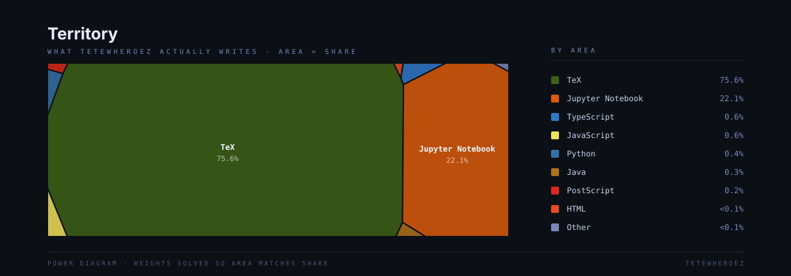

# About Me 

I'm **Teo**, also known as **Tetew**, a mathematics graduate from **Institut Teknologi Sepuluh Nopember** with a thorough understanding of the material covered in all required mathematics courses. I enjoy solving mathematical problems and turning complex ideas into clear, well-structured explanations.

**Things I enjoy**

- 📝 Writing mathematical explanations and detailed worked solutions with $\LaTeX$, as well as preparing assignments.
- 📚 Watching anime and reading manga or light novels.
- 🎮 Playing my favorite games.

  
  
  
  

## Skills
         

## Frameworks & Tools

     

<h2>Territory</h2>

  

## Statistics

## Donate
You can support me on [Trakteer][trakteer].

[trakteer]: https://trakteer.id/tetewheroez
